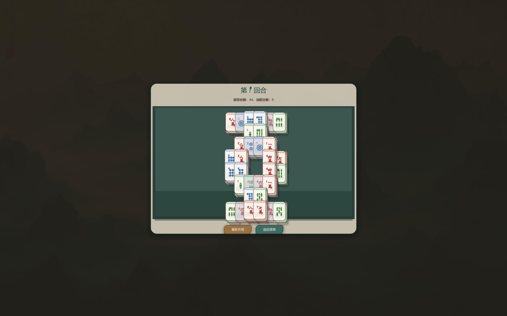
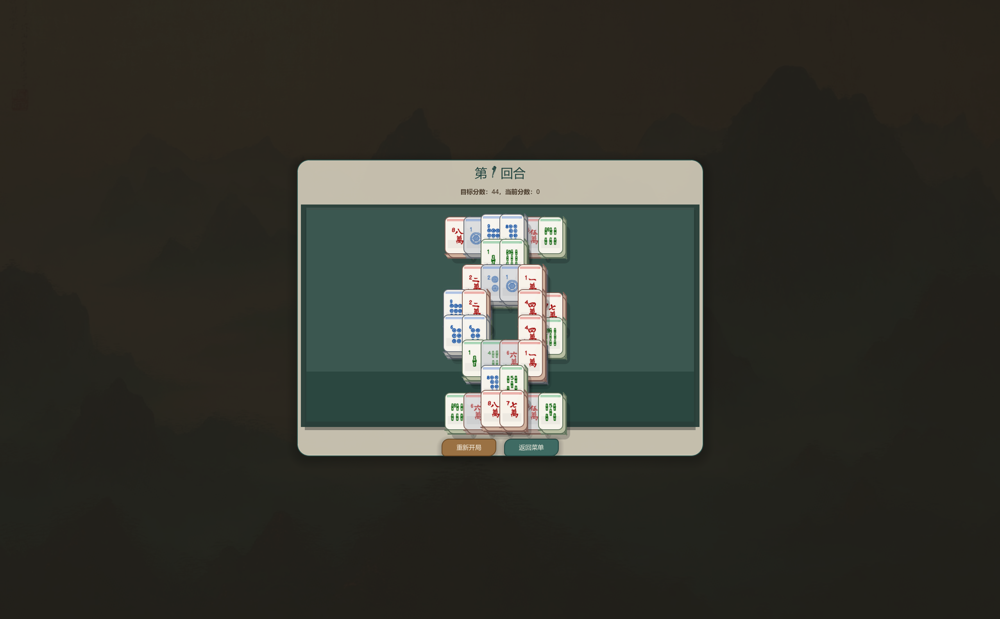

# CHANGELOG

项目后续统一按纯 Godot 主线记录。当前主工程保持目录名 `first-demo(0.1.0)/` 不变；`first-demo/` 只作为早期基础 demo 参考；`malegema/` 为历史 Python 实验实现，不再作为主要推进线。

## [0.1.6] 2026-05-14

### 调整

- 添加教程：修复直接进入教程需先启动游戏的问题，修正高亮相关与成员重复定义导致的解析报错，并提升教程提示文字与按钮尺寸。
- 棋盘：取消全局抖动反馈，仅保留牌面自身动画；修复首次点击导致整体缩放的牌面动画问题，设置缩放下限避免缩小。
- 难度：之后再调整
- 添加背包：改为逐张牌展示并按卡牌/材质顺序排序，新增牌插入到对应位置；移除多余阴影与数量文字，桌上牌以透明区分。
- 商店：详情面板展示完整牌面；支持按所选商品冻结，刷新保留冻结项，购买/升级会解除冻结并有反馈。
- 保存功能（未测试正确与否）

### 修复

- 修复 `roundMaxPoints` 类型推断警告被视为错误的问题（显式类型）。

## [0.1.5] 2026-05-14

### 调整

- 为风牌消除后的上层牌推动效果增加可见动画：被推动的牌会从旧位置滑向新位置，并带有短暂高亮和过冲回弹。
- 新增风牌方向性覆盖动画：消除北/南/东/西风时，棋盘上会出现对应方向扫过的曲线风痕、淡蓝色风压和尘粒效果。
- 棋盘刷新流程新增移动前后位置快照，只有牌的网格坐标实际变化时才触发移动动画，避免普通点击或失败匹配误触发。
- 修正商店冻结逻辑：只有冻结状态为 active 时才沿用冻结时的 round/reroll，取消冻结后会立即刷新回当前商店池。
- 新增回合结算阶段：棋盘结束后自动进入结算页，不再要求玩家在棋盘页手动点击继续；结算页展示棋盘得分、过关分数、时间扣分、结算分、金币收益和下一步。
- 棋盘界面顶部新增实时分数条，显示已有分数、过关分数和预计结算分，方便玩家在回合中判断是否接近通关。
- 商店右侧详情面板新增 `商品详情 / 当前牌组` 页签，当前牌组页签按基础牌和特殊牌分组展示牌图、数量、材质分布和简短效果说明。
- 商店购买和升级成功后新增明确反馈，显示“已加入牌组/已升级 · 下局生效”，并高亮当前牌组页签与对应牌组条目。

### 验证

- 已通过 Godot 4.6.1 无头加载验证：项目加载、`board.tscn`、`run_end.tscn`、`run_shop.tscn` 加载和 `module_regression_runner.gd` 均正常退出。

## [0.1.4] 2026-05-14

### 新增

- 商店新增选中商品详情面板，显示牌图、价格、类型、点数、颜色、牌组已有数量、材质分布和升级预览。
- 商店商品列表新增明确选中态，点击商品即可在右侧同步展示详情。
- 新增 `AGENTS.md` 项目协作约定，明确后续每次修改都必须同步记录到 `CHANGELOG.md`。

### 调整

- 商店页面改为更大的左右分栏布局，提升商品列表、操作按钮和说明文字的可读性。
- 棋盘主面板、标题、状态文字和按钮整体放大，减少全屏或高分辨率下界面偏小的问题。
- 棋盘布局允许小牌局按可用空间放大到 `1.45` 倍，不再固定最高 `1.0` 倍。
- `WhatajongUI` 增加统一字号常量，并支持在 `apply_button()` / `apply_display_font()` / `tint_body_text()` 中传入字号。
- `project.godot` 启用 `canvas_items` stretch 与 `expand` aspect，让 1920x1080 设计尺寸随窗口缩放。

### 说明

- 本次无法执行 Godot CLI 无头加载验证，因为当前系统 PATH 中未找到 `godot` 命令。

## [0.1.3] 2026-05-07

### 新增

- 新增 run 外循环核心：`RunState` / `DeckState` / `RunManager`。
- 迁移 round 生成、难度曲线、收益计算与阶段推进逻辑。
- 新增商店、奖励、结算三类基础场景与脚本：
  - `run_shop`
  - `run_reward`
  - `run_end`
- 新增商店条目生成、购买与升级逻辑，支持 3 合 1 链路。
- 新增 `reroll` / `freeze` 基础行为。
- 新增金币计算与计入逻辑，包含材质与兔子加成，并与回合结算收入合并。

### 调整

- `board.gd` 接入 run 外循环：按 run deck 开局、记录时间/金币、结算后进入 reward / shop / end 阶段。
- `start_menu.gd` 改为启动新 run 并进入 game 阶段。
- `project.godot` 注册 `RunManager` 为 autoload 单例。
- 调整麻将牌增多时的布局缩放，避免超出画幅。

### 说明

- 当前 UI 仍是功能性版本，主要用于验证回合链路。
- 难度暂时默认 easy，后续应在开始菜单扩展 easy / medium / hard 选择入口。
- 本阶段代码位于 `first-demo(0.1.0)/`，该目录后续作为当前 Godot 主工程继续推进。

## [0.1.2] 2026-04-16

### 新增

- 将 `whatajong` 的背景层视觉迁移到 Godot demo。
- 新增可复用的 `WhatajongBackdrop` 场景与脚本，用于统一底色、纹理层、山形前景与氛围叠层。
- 新增 `WhatajongUI` 样式辅助脚本，统一面板、按钮与标题字体风格。

### 调整

- `gameStar.tscn` 与 `board.tscn` 改为实例化 `WhatajongBackdrop`，不再各自维护单色背景块。
- 开始菜单、帮助弹窗、设置弹窗与棋盘主面板统一切换为 `whatajong` 风格。

### 修复

- 修复 `WhatajongUI.apply_panel()` 对 `PopupPanel` 的类型兼容问题，避免 Godot 解析期报错。

### 说明

- 牌面在配对后触发其余牌变化，仍属于特殊牌模块的既有功能，本阶段未改动该玩法逻辑。

## [0.1.1] 2026-04-16

### 新增

- 将麻将牌视觉升级为 2.5D 风格，加入厚度、阴影、高光、材质色带与更明显的层次表现。
- 为牌面交互增加更有反馈感的动画表现：
  - 悬停抬升
  - 点击压缩
  - 选中发光
  - 错误点击抖动
  - 配对消除的撞击与淡出效果
- 为棋盘补充桌面分层和氛围表现，增强整体立体感与视觉聚焦。

### 调整

- 重做 `12` 张最小可玩局的地图裁剪逻辑，改为真实的多层 `6-4-2` 分层布局。
- 调整棋盘排版逻辑，改为根据牌堆包围盒自动居中，并在容器尺寸变化时重新布局。
- 清理部分场景脚本资源的失效 UID 引用，减少加载时的无效资源警告。

### 修复

- 修复 Godot 4 严格类型检查下的若干脚本报错。
- 修复局部变量与基类成员重名引发的 shadowing 警告。
- 修复配对消除后访问已释放节点导致的 `Trying to cast a freed object` 崩溃。
- 修复重新开始第二局后旧节点延迟释放误删新节点引用的问题。
- 修复 `BoardManager.gd` 与新的 `Tile` 信号/参数写法之间的兼容性问题。

## [0.1.0] 2026-04-01

### 说明

- 完成第一版可玩 Godot 原型，用于验证基础牌面、点击和配对消除。

### 新增

- 将麻将牌拆分为独立场景 `Tile.tscn`，与主游戏界面解耦。
- 在 `board.tscn` 中替换为正常的麻将牌显示，并保留基础配对消除逻辑。
- 为牌面加入基础悬停与点击反馈。

## [0.0.0]

### 说明

- 项目起点版本。
- 确认纯 Godot 原型方向。
- 建立最早期开始菜单与棋盘骨架，用于后续迭代。
